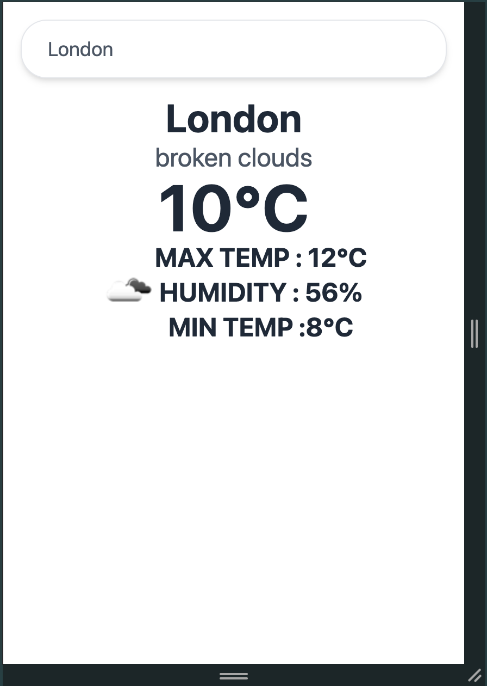

# React Weather App

This React Weather App allows users to fetch weather information by typing the name of a city. The application is built with React and Vite and utilizes Axios for fetching weather data from the OpenWeatherMap API. Tailwind CSS is used for styling the user interface.

## Features

- **City-based Weather Search:** Users can enter the name of a city to fetch current weather information.
- **Responsive Design:** The user interface is designed to be responsive and work seamlessly across different screen sizes.
- **Live Weather Updates:** Weather information is fetched in real-time from the OpenWeatherMap API, providing accurate and up-to-date data.

## Installation

To run the Weather App locally, follow these steps:

1. Clone this repository: `git clone https://github.com/Chouikhi-abdallah/React-Realtime-Weather-App.git`
2. Navigate to the project directory: `cd <project-directory>`
3. Install dependencies: `npm install or yarn install`
4. Install Axios:`npm install axios`
6. Start the development server: `npm run dev`

## Technologies Used

- **React:** A JavaScript library for building user interfaces.
- **Vite:** A fast build tool that leverages native ES modules for faster development and HMR.
- **Axios:** A promise-based HTTP client for making API requests.
- **Tailwind CSS:** A utility-first CSS framework for styling web applications.

## API Key

This application uses the OpenWeatherMap API to fetch weather data. You will need to sign up for an API key at [OpenWeatherMap](https://openweathermap.org/) and replace `YOUR_API_KEY` in the `App.jsx` file with your actual API key.

## Contributions

Contributions are welcome! If you have any suggestions, bug reports, or feature requests, please open an issue or submit a pull request.

## Project preview

